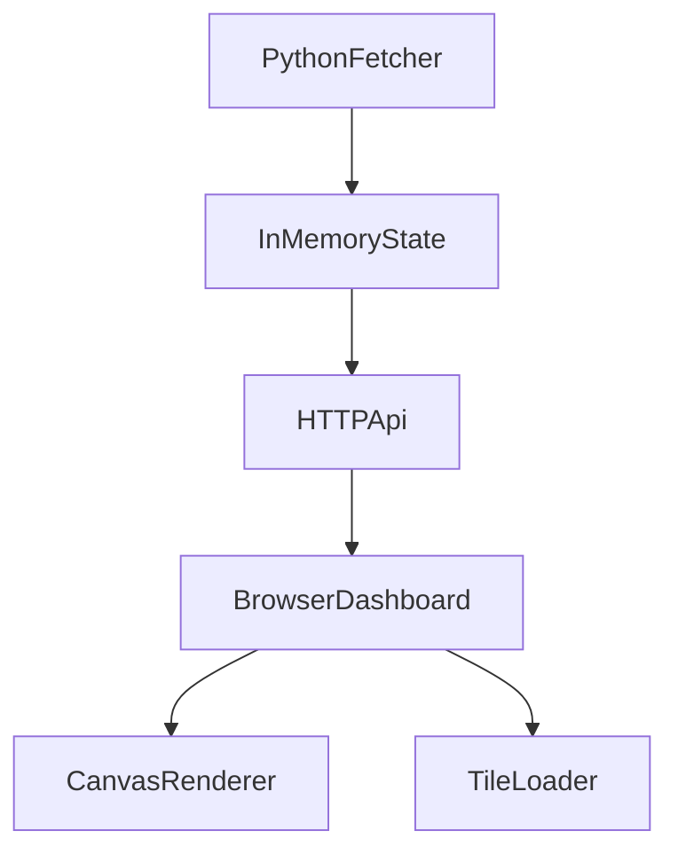

# MobileAir Dashboard + Emoji Map

## Goals (what you asked for)

- **Browser dashboard** (not the Textual TUI) with a **map panel**.
- **Real-time emoji vehicle markers** for mobile sensors.
- **Breadcrumb trails** showing each vehicle’s previous readings at the correct historical coordinates; render as a **dotted path** for now.
- **Third-party map only for basemap**: use OSM/other tiles as imagery, but **draw all markers/paths ourselves** (no Leaflet markers/polylines or default styling).

## Architecture

- **PythonFetcher**: periodically fetches `MobileMapData.json` and `FixedSiteMapData.json`, normalizes and extracts:
- **current position** per mobile sensor
- **breadcrumb polyline** per mobile sensor from historical `Latitude/Longitude/TimeUTC`
- key readings (PM25/PM10/OZNE) + colors
- **HTTPApi**: serves `/` dashboard HTML/JS, and `/api/state` JSON.
- **BrowserDashboard**: loads basemap tiles + draws overlays on `<canvas>`:
- **tile canvas** for basemap (OSM tiles)
- **overlay canvas** for emojis + dotted breadcrumb trails

## Map rendering approach (no map library)

- Implement **Web Mercator** coordinate conversion in JS.
- Render basemap by fetching slippy tiles: `/{z}/{x}/{y}.png` from OSM (or another tile host you choose).
- Implement minimal interactions:
- **drag to pan**
- **+ / - zoom** (recompute tiles + overlay)
- Overlay draw:
- each mobile sensor: draw an **emoji glyph** at current projected pixel
- each sensor trail: draw dotted polyline using `ctx.setLineDash([…])`
- optional: draw a small label badge next to emoji with sensor ID/custom name

## Breadcrumb/trail logic

- For each mobile sensor and pollutant stream, extract historical parallel arrays:
- `Latitude[]`, `Longitude[]`, `TimeUTC[]`
- Build a **time-sorted** list of points and keep the last N minutes (default: 30) or last N samples (default: 50).
- Trail is rendered once per refresh; current position is the last valid point.

## UX / dashboard layout (updated)

- **Map-dominant layout** (not 3 equal columns).
- **Left list** becomes a slim, high-contrast “at-a-glance” strip:
- per sensor: emoji, ID/name, and 1–3 key readings **with their API colors** (no chip/bubble UI)
- pinned sensors stay on top
- **Right inspector** stays, but only shows for the selected sensor (or is collapsible).
- **Clicking a sensor centers the map on it**.
- Auto-refresh every 5–10 seconds.

## Files to add / change

- Add `dashboard_server.py`: HTTP server + fetch loop + `/api/state`.
- Add `dashboard/` static assets:
- `dashboard/index.html`
- `dashboard/app.js` (tile loading + mercator + drawing overlays)
- `dashboard/styles.css`
- Extend `mobileair_core.py` with:
- `extract_mobile_tracks(mobile_json, lookback_minutes, max_points)`
- `normalize_state_for_dashboard(combined_data, custom_names, pinned)`
- Update `requirements.txt` only if we choose a framework; default plan uses **stdlib** server.

## Testing

- **Python unit tests** (stdlib `unittest`) for:
- track extraction + trimming
- state JSON shape
- **Smoke test**:
- start server, hit `/api/state` once, validate JSON parses

## Open decisions (already resolved)

- Dashboard is **browser-based**.
- Overlay/projection is **ours**; no map library for overlay/projection.

## Implementation todos

- `server-state`: Implement `dashboard_server.py` fetch loop + `/api/state` JSON.
- `core-tracks`: Add core helpers to extract mobile breadcrumb tracks with timestamps.
- `dashboard-ui`: Build `dashboard/index.html` + CSS layout.
- `map-renderer`: Implement JS tile loader + mercator projection + pan/zoom + overlay drawing (emoji + dotted trails).